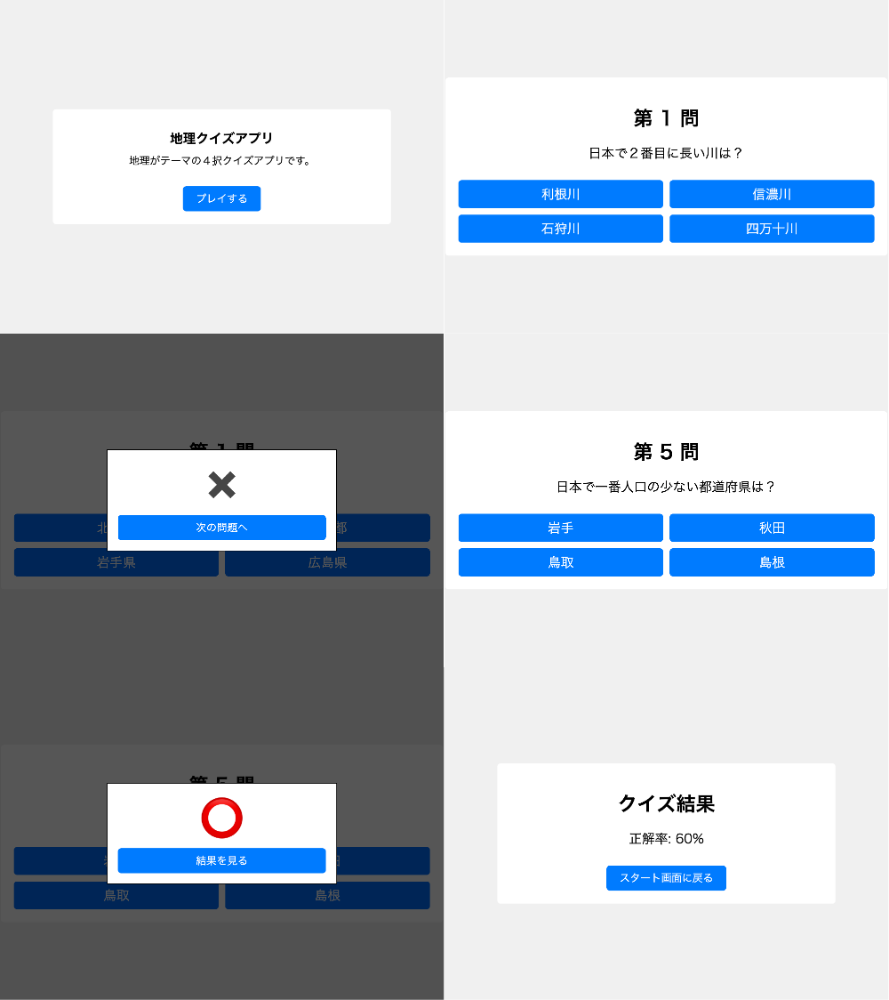
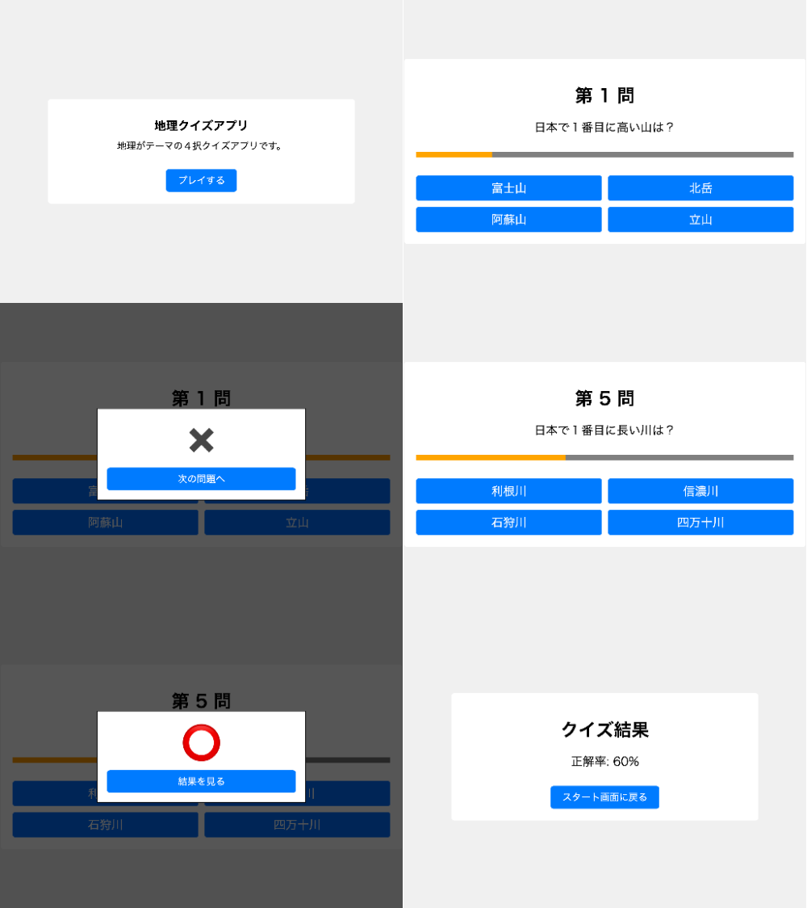

# 地理クイズアプリ

日本の地理をテーマにしたクイズアプリです。
JavaScript の学習コンテンツで、HTML,CSS,JavaScript で実装しています。

## v1

### 技術スタック

- JavaScript の基本構文（変数、配列、分岐処理、繰り返し処理、関数）
- DOM とイベント（click イベント）

### 画面

## v2

### 技術スタック

- JavaScript の基本構文（変数、配列、分岐処理、繰り返し処理、関数）
- JavaScript の組み込みオブジェクト（Date）
- DOM とイベント（setInterval、click イベント）

### 画面

